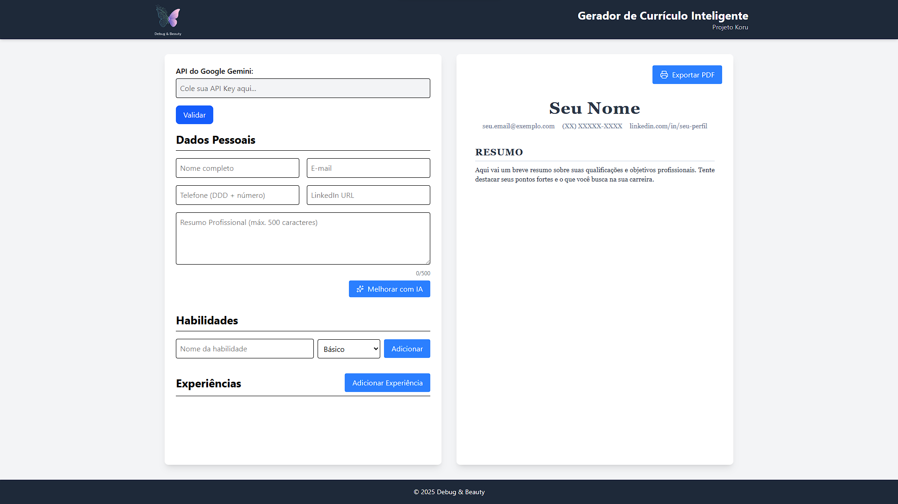

# 📄 Gerador de Currículo Inteligente

Uma aplicação **React moderna** que permite criar currículos
profissionais com **preview em tempo real**.\
Este projeto foca em conceitos avançados de **React** e **TailwindCSS**,
com arquitetura escalável e design clean.

------------------------------------------------------------------------

## 🚀 Tecnologias Utilizadas

-   **React 19**
-   **TypeScript**
-   **Vite**
-   **TailwindCSS v4**

------------------------------------------------------------------------

## 🎯 Conceito da Aplicação

Layout **split-screen** otimizado para desktop:

-   **Esquerda (50%)** → Formulário de entrada de dados\
-   **Direita (50%)** → Preview instantâneo do currículo\
-   **Foco**: produtividade e experiência desktop (não responsivo para
    mobile)

------------------------------------------------------------------------

## 📝 Funcionalidades

-   Preview **instantâneo** ao digitar\
-   **Listas dinâmicas** para adicionar/remover habilidades e
    experiências\
-   Layout desktop moderno e fixo\
-   Validação em tempo real nos formulários\
-   Indicação visual de campos obrigatórios ou vazios

------------------------------------------------------------------------

## 📌 Estrutura do Formulário

1.  **Dados Pessoais**
    -   Nome, Email, Telefone, LinkedIn\
    -   Resumo profissional (com contador de caracteres)
2.  **Habilidades**
    -   Adição/remoção dinâmica\
    -   Nível de proficiência (Básico / Intermediário / Avançado)
3.  **Experiências**
    -   Empresa, Cargo, Período, Descrição\
    -   Checkbox "Trabalho atual"\
    -   Validação de datas

------------------------------------------------------------------------

## 🧩 Conceitos React Praticados

-   **Estado compartilhado avançado**\
-   **Componentes controlados** (inputs, textareas, listas)\
-   **Props e Lifting State Up** (comunicação entre componentes)\
-   **Renderização condicional avançada**

------------------------------------------------------------------------

## ⚡ Como Rodar o Projeto

1.  Clone este repositório:

    ``` bash
    git clone https://github.com/seu-usuario/gerador-curriculo-inteligente.git
    ```

2.  Entre na pasta do projeto:

    ``` bash
    cd gerador-curriculo-inteligente
    ```

3.  Instale as dependências:

    ``` bash
    npm install
    ```

4.  Rode o servidor de desenvolvimento:

    ``` bash
    npm run dev
    ```

5.  Abra no navegador:

        http://localhost:5173

------------------------------------------------------------------------


## 🖼️ Preview do Projeto




------------------------------------------------------------------------